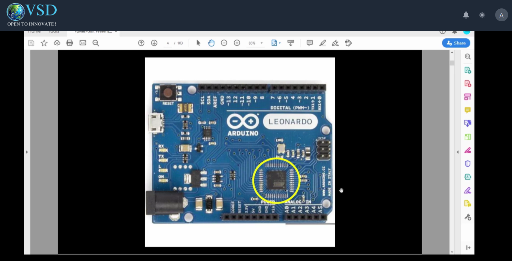
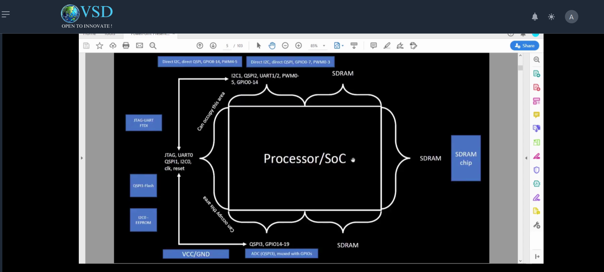
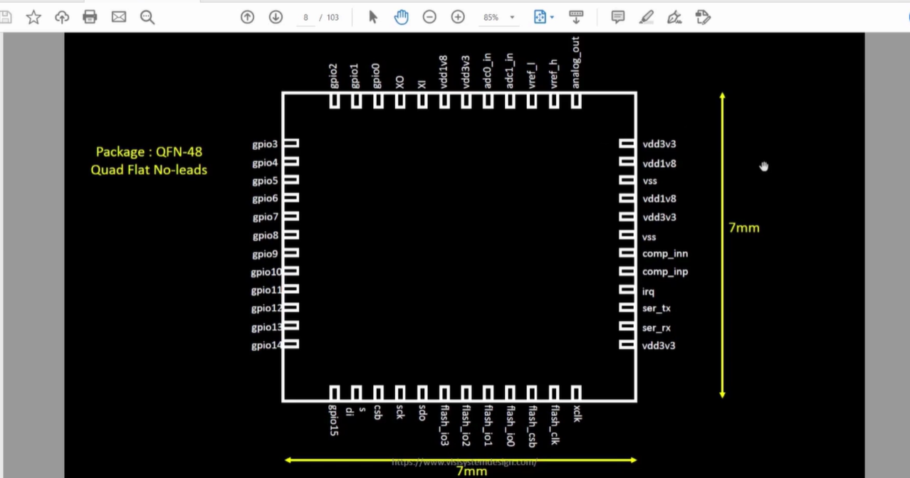
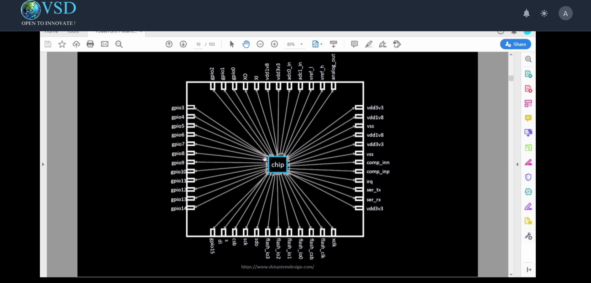
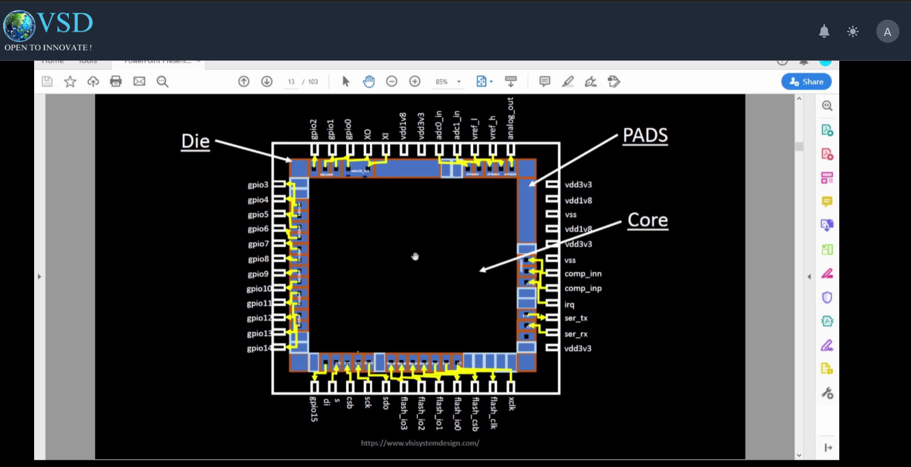
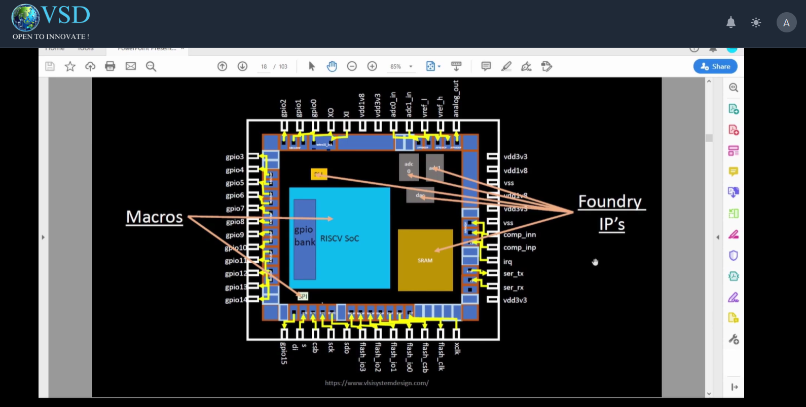
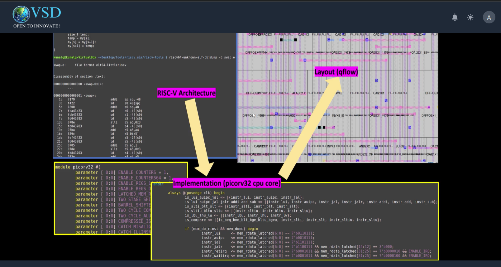
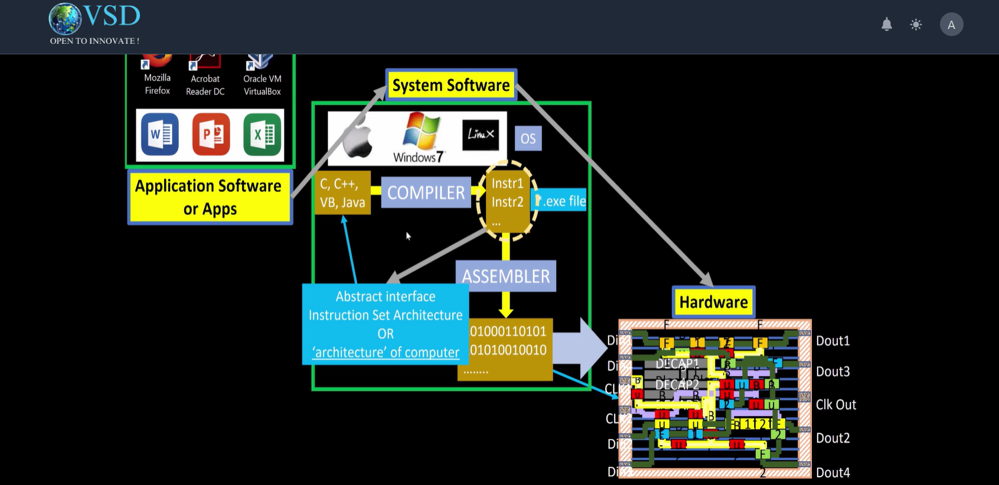
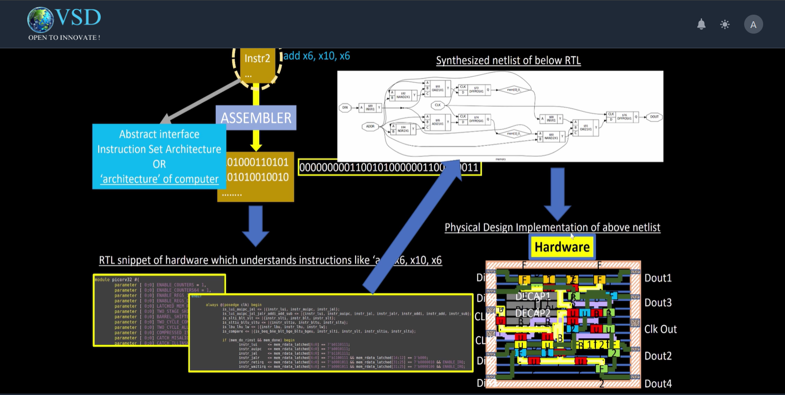

# Sky130 Day 1 - Inception of open-source EDA, OpenLANE and Sky130 PDK  

#How to talk to computers:  

> Introduction to QFN-48 Package, chip, pads, core, die and IPs  
Image below shows the Arduino board with a IC which is the core of the board which is a microcontroller:  
  

Below image describes the system view of the Arduino board.  
  

  

  

  

  

> Introduction to RISC-V  

  

> From Software Applications to Hardware  

  

  

#Soc Design and OpenLANE  
> Introduction to all components of open-source digital asic design  
> Simplified RTL2GDS flow  
> Introduction to OpenLANE and Strive chipsets  
> Introduction to OpenLANE detailed ASIC design flow  

#Get familiar to Open-source EDA Tools  
> OpenLANE Directory structure in detail  
> Design Preparation Step  
> Review files after design prep and run synthesis  
> OpenLANE Project Git Link Description  
> Steps to characterize synthesis results  

