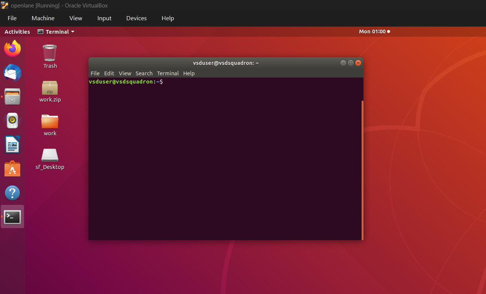
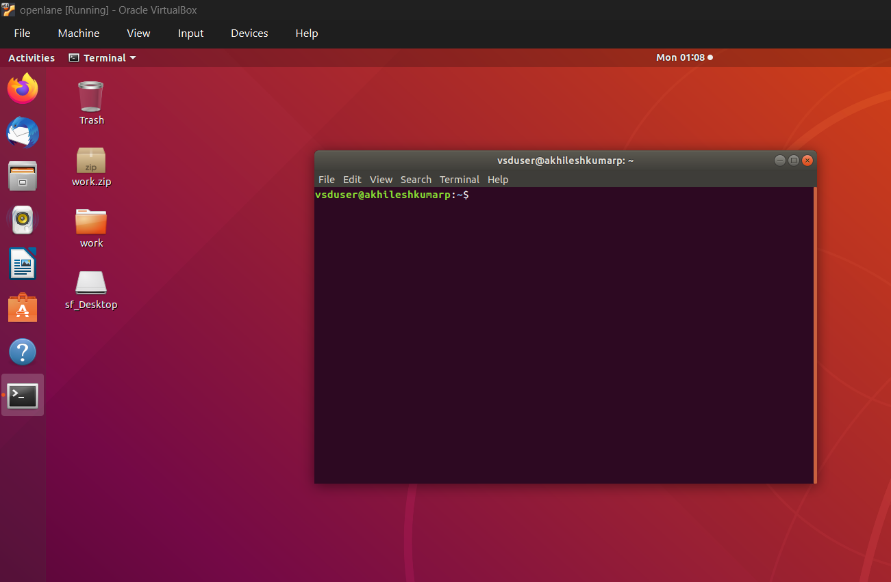
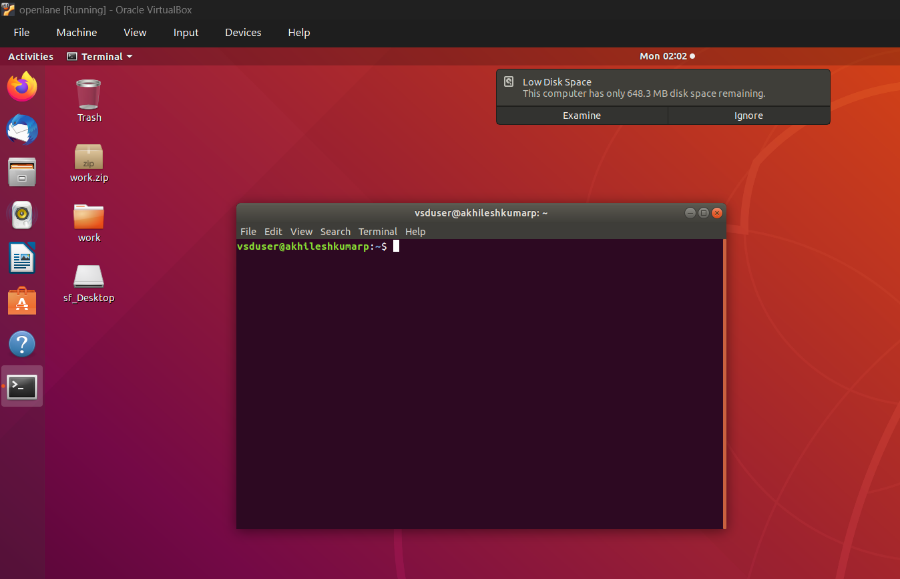
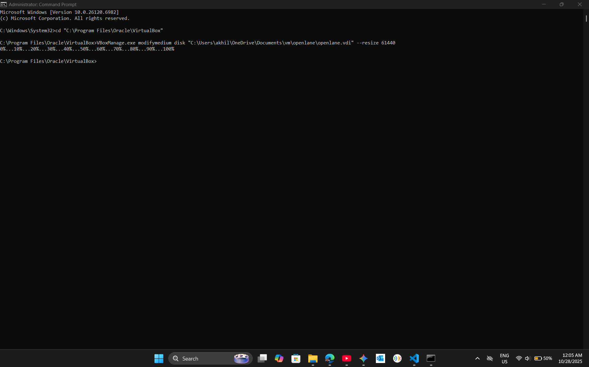
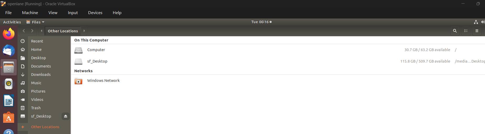

update default hostname to username to personal in the vm

1. How to Change the Hostname
This is the name of your computer (e.g., what you see after the @ in your prompt: user@**hostname**). This is a safe and simple operation.

Set the new hostname: Replace new-hostname with your desired name.

Bash

sudo hostnamectl set-hostname new-hostname
Update the hosts file: This step is important to ensure sudo and other services continue to work correctly.

Bash

sudo nano /etc/hosts
You will see a file with lines like this:

127.0.0.1       localhost
127.0.1.1       old-hostname
Change old-hostname to match the new-hostname you just set. Save the file and exit (In nano, press Ctrl+O to save, then Ctrl+X to exit).

Apply changes: The change will be fully applied after you reboot your VM.

Bash

sudo reboot

Extend the Partition (GParted) 
This step uses the GParted Live ISO to boot the VM and extend the OS partition to fill the new 30 GB of unallocated space.
Download GParted Live ISO:Go to the GParted official website and download the latest stable "live" ISO file (e.g., gparted-live-x.x.x-x-amd64.iso). 
Attach GParted ISO to VM:In VirtualBox, select your VM (which is powered off). 
Go to Settings -> Storage.Under the "Controller: IDE" (or SATA), click the Empty optical drive icon.On the right-hand "Attributes" panel, click the blue disc icon and select Choose/Create a Virtual Optical Disk.... 
Click Add and select the GParted ISO file you downloaded. 
Click Choose and then OK.Boot the VM from the ISO:Start your VM. 
It should boot into the GParted menu.  
Press Enter to accept the default "GParted Live (Default settings)" option. 
Follow the prompts for language and keyboard layout (pressing Enter for the defaults is usually fine). 
GParted will launch automatically.Resize the Partition in GParted: 
You will see a visual representation of your disk. 
It will show your main partition (e.g., /dev/sda1, $\approx 30 \text{ GB}$), 
possibly a swap partition, and then unallocated space ($\approx 30 \text{ GB}$). 
Simple Case (No swap partition in the way):Right-click on your main partition (the 30 GB one).Select Resize/Move.A new window will appear.  
Drag the right-hand arrow of the partition all the way to the right, filling the unallocated space.Click the Resize/Move button. 
If a swap partition is in the way:Right-click the linux-swap partition and select Swapoff.Right-click the linux-swap partition and select Delete. 
Now, right-click your main partition and follow the "Simple Case" steps to resize it (you can leave a little space at the end for a new swap partition if you wish). 
Click the Apply All Operations button (green checkmark) in the toolbar. 
Confirm the operation by clicking Apply in the pop-up.

